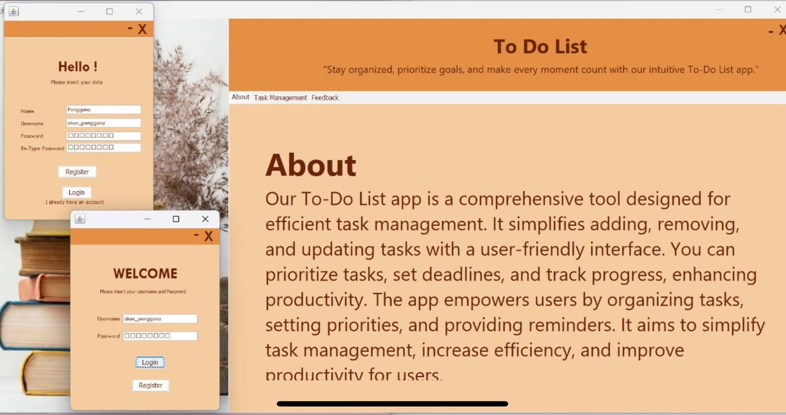
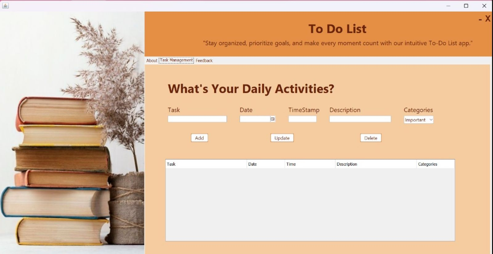

# ✅ Java To-Do List Desktop App

Welcome to the repository of my **To-Do List Java Desktop App** — an application designed to help users manage daily tasks efficiently and stay organized! 📅📌

Built using **Java (Swing GUI)** with **XAMPP (MySQL)** as the database backend.

---

## 🧭 App Overview

This desktop app includes **user authentication** and a powerful task management system packed in a clean and simple GUI interface.

### 🖥️ Main Pages:

1. 🔐 **Register Page**  
   - Allows new users to sign up.  
   - Data is saved to the **MySQL database** via XAMPP backend.

2. 🔑 **Login Page**  
   - Registered users can log in to their account.  
   - Credentials are validated from the **user database**.

3. 🏠 **Dashboard Page**  
   - After successful login, users are redirected here.  
   - Contains 3 main tabs:

---

## 📋 Dashboard Tabs

### 🧾 About Tab
Provides a short introduction to the app — what it does and how to use it.

### 🗂️ Task Management Tab
The heart of the app! Users can:

- ➕ Add new tasks with:
  - Task name
  - Date & timestamp
  - Description
  - Category: `Important`, `Medium`, or `Normal`
- 🧾 View all tasks in a **task table**
- 🔄 Perform full **CRUD operations**:
  - Create ✍️
  - Read 👁️
  - Update 🛠️
  - Delete 🗑️

### 🗣️ Feedback Tab
A simple form to collect user feedback or suggestions. 📬

---

## 💡 Features

- 🧑‍💻 User registration and login system (with database integration)
- 🧾 Structured task input with priority categorization
- 📊 Task table with full CRUD functionality
- 🖥️ Built using Java Swing for GUI
- 🛢️ MySQL database via XAMPP
- 💾 Persistent data storage

---

## 🛠️ Tech Stack

- ☕ **Java** (Swing for GUI)
- 🗃️ **MySQL** (via XAMPP)
- 🌐 **JDBC** for database connection
- 📦 NetBeans IDE

---

## 🖼️ App Preview

---

## 🚀 How to Run

1. 🧰 Install XAMPP and start Apache + MySQL
2. 📁 Import the provided SQL file into phpMyAdmin
3. 🖥️ Open the project in NetBeans / Eclipse
4. 🔌 Configure your DB connection (host, user, password)
5. ▶️ Run the application

---

## 🤝 Let's Connect!

Questions, ideas, or feedback? Feel free to reach out!

- 💌 Linktr.ee: https://linktr.ee/qonitaqq

---

> *“The secret of getting ahead is getting started.”* – Mark Twain 💬

---

Thanks for visiting! Don’t forget to ⭐️ the repo if you find it useful!
